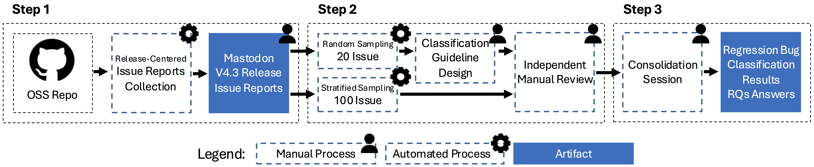
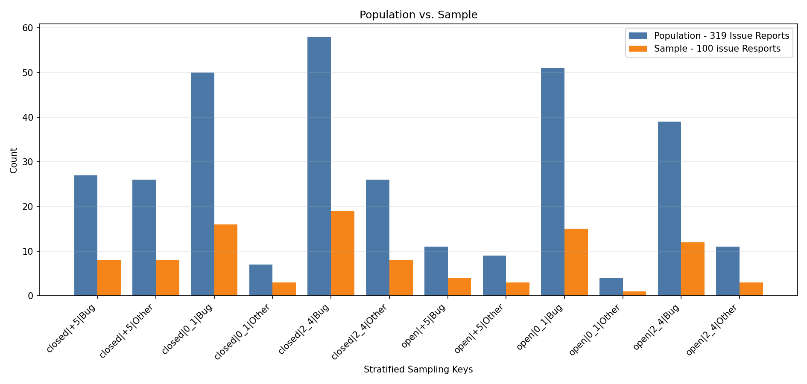

# Regression Bug Classification — CrowdRE'26

**Replication package for:**
> *Regression Bugs in Post-Release GitHub Issue Reports: A Pilot Study*

---

## Overview

This repository contains the data, classification guideline, and results for a pilot empirical study investigating whether crowd feedback in GitHub issue reports can provide evidence for identifying regression bugs after a software release.

We manually classify 100 issue reports from the **Mastodon v4.3 release family** using a structured multi-artifact classification guideline that synthesizes evidence across issue reports, developer discussions, pull requests, commits, and release notes.

**Key findings:**
- 65 of 100 sampled issues are confirmed bugs (65%)
- 20 of 65 confirmed bugs are regression bugs (31%)
- 90% of confirmed regression bugs have no existing test coverage for the affected behavior
- Four recurring patterns characterize crowd-detectable regressions invisible to automated test-based approaches

---

## Subject System

**Mastodon** — a federated, open-source social networking platform built on Ruby on Rails and React, communicating via the ActivityPub protocol. Its issue tracker includes reports from end users, server administrators, third-party client developers, and core maintainers, making it a suitable setting for studying crowd-reported regression evidence.
https://github.com/mastodon/mastodon

### Issue Collection

All open and closed issues from the Mastodon GitHub repository were collected via the GitHub API. Regular expressions were applied to retain only issues referencing the v4.3 release family. Issues opened before the first v4.3 release were excluded.

**Table 1. Mastodon v4.3 release-family issue report distribution**

| Patch | Open | Closed | Total |
|---|---|---|---|
| v4.3.0-beta.1 | 2 | 9 | 11 |
| v4.3.0-beta.2 | 6 | 7 | 13 |
| v4.3.0-rc.1 | 5 | 4 | 9 |
| v4.3.0 | 25 | 56 | 81 |
| v4.3.1 | 25 | 33 | 58 |
| v4.3.2 | 11 | 16 | 27 |
| v4.3.3 | 17 | 11 | 28 |
| v4.3.4 | 6 | 11 | 17 |
| v4.3.5 | 1 | 0 | 1 |
| v4.3.6 | 2 | 5 | 7 |
| v4.3.7 | 4 | 13 | 17 |
| v4.3.8 | 16 | 20 | 36 |
| v4.3.9 | 3 | 8 | 11 |
| v4.3.10–v4.3.20 | 2 | 1 | 3 |
| **Total** | **125** | **194** | **319** |

---

## Approach

The study follows three steps:

1. **Issue collection and stratified sampling** — 319 issues filtered from 12,756 total; 100 selected via stratified sampling across issue label, state, and discussion activity
2. **Classification guideline and independent annotation** — Two annotators apply the multi-artifact guideline independently
3. **Consolidation and analysis** — Disagreements resolved through structured discussion; results analyzed to answer three research questions

### Stratified Sampling

Sampling stratified across three dimensions:
- **Issue label** — bug-labeled vs. other (suggestion, feature request, troubleshooting)
- **Issue state** — open vs. closed
- **Discussion activity** — 0–1 comments / 2–4 comments / 5+ comments

---

## Classification Guideline

The full guideline is available in [`guideline/classification_guideline.pdf`](guideline/classification_guideline.pdf).

The guideline follows a two-stage process:

**Stage A — Bug vs. Not a Bug**
Each issue is classified as Bug, Not a Bug, or Unknown based on the issue title, body, labels, and discussion thread.

**Stage B — Regression Bug Classification**
Confirmed bugs are classified as Regression Bug, Other Bug, or Unknown by triangulating evidence across five artifact levels:

| Level | Artifact | Description |
|---|---|---|
| 1 | Issue title and body | Temporal anchors, version references, before/after comparisons |
| 2 | Issue discussion | Developer confirmation, technical diagnosis, contributor analysis |
| 3 | Linked pull request | Repair evidence, regression identification, revert confirmation |
| 4 | Commit / code change | Implementation-level confirmation of the introducing change |
| 5 | Release note | Official project corroboration of the fix in a subsequent patch |

**Operational definition of a Regression Bug:**
> A bug in which an existing feature, behavior, workflow, or quality attribute previously worked correctly but became broken, degraded, or incorrect after a software change or release.

---

## Results

### Classification Outcomes

**Table 2. Stage A: Bug vs. Not a Bug (N = 100)**

| Total Issues | Bug | Not a Bug | Unknown |
|---|---|---|---|
| 100 | 65 | 33 | 2 |

Inter-annotator agreement: κ = 0.78 (substantial agreement) — 89 agreements / 11 disagreements before consolidation.

**Table 3. Stage B: Regression Bug Classification (N = 65 bugs)**

| Total Bugs | Regression Bug | Other Bug | Unknown |
|---|---|---|---|
| 65 | 20 | 36 | 9 |

Inter-annotator agreement: κ = 0.57 (moderate agreement) — 41 agreements / 13 disagreements across 54 eligible issues before consolidation. Stage B agreement is computed only over issues where both annotators independently assigned Bug in Stage A.

### Evidence Chain Coverage

Of the 20 confirmed regression bugs:

| Evidence Level | Issues | % |
|---|---|---|
| Issue title and body | 17 / 20 | 85% |
| Issue discussion | 17 / 20 | 85% |
| Linked pull request | 9 / 20 | 45% |
| Commit / code change | 13 / 20 | 65% |
| Release note | 14 / 20 | 70% |
| Complete five-level chain | 4 / 20 | 20% |
| Existing test coverage | 2 / 20 | 10% |

Full per-issue evidence chain is available in [`results/regression_bugs_evidence_chain.csv`](results/regression_bugs_evidence_chain.csv).

---

## Regression Patterns

Four recurring patterns characterize the 20 confirmed regression bugs and explain why they remain invisible to automated test-based approaches.

### Pattern 1 — User-Interface and Workflow Degradation (45%, 9 issues)
Regressions where the system continues to function at the code level but no longer provides users with information or affordances they previously relied upon. These require user-facing oracles — assertions about what must be visible in the interface — that are rarely encoded in automated test suites.

*Examples: mute duration no longer shown in the web interface (#32371); media fallback placeholder removed for unknown attachment types (#32595); layout overflow on narrow screens (#31679).*

### Pattern 2 — Accessibility and Quality Regressions (20%, 4 issues)
Regressions involving usability or accessibility degradation rather than functional failures. These violations are detectable only through users reporting their lived experience of an interface change. No automated test can assert that a UI change is "anxiety inducing" or causes eyestrain.

*Examples: content warning styling causing accessibility concerns (#32352); dark theme color change causing eyestrain for visually impaired users (#32325); oversized button text overlapping content for users with larger font sizes (#32570).*

### Pattern 3 — Configuration and Environment-Dependent Failures (25%, 5 issues)
Regressions visible only under specific configurations, dependency versions, or deployment environments. Standard CI test suites do not exercise the full range of production deployment configurations encountered by the crowd of administrators.

*Examples: HEIF image rendering broken by a dependency upgrade (#31570); Redis namespace escaping broken via a gem dependency change (#34082); Docker configuration typo affecting administrator deployments (#31611).*

### Pattern 4 — API and Integration Boundary Failures (10%, 2 issues)
Regressions at the boundary between Mastodon's server-side behavior and external consumers, including third-party client applications and external sites. These require knowledge of external usage patterns that the development team's test suite cannot anticipate.

*Examples: search API returning 422 errors with pagination parameters used by third-party clients (#32731); embed code sanitization change breaking iframe embeds on external sites (#32408).*

---

## Annotators

| Annotator | Background |
|---|---|
| Annotator A | PhD student in Computer Science — software engineering and requirements engineering |
| Annotator B | Master's student in Computer Science — 10+ years of industry software engineering experience |

Annotation was conducted independently. Disagreements were resolved through structured consolidation sessions applying the classification guideline criteria.

